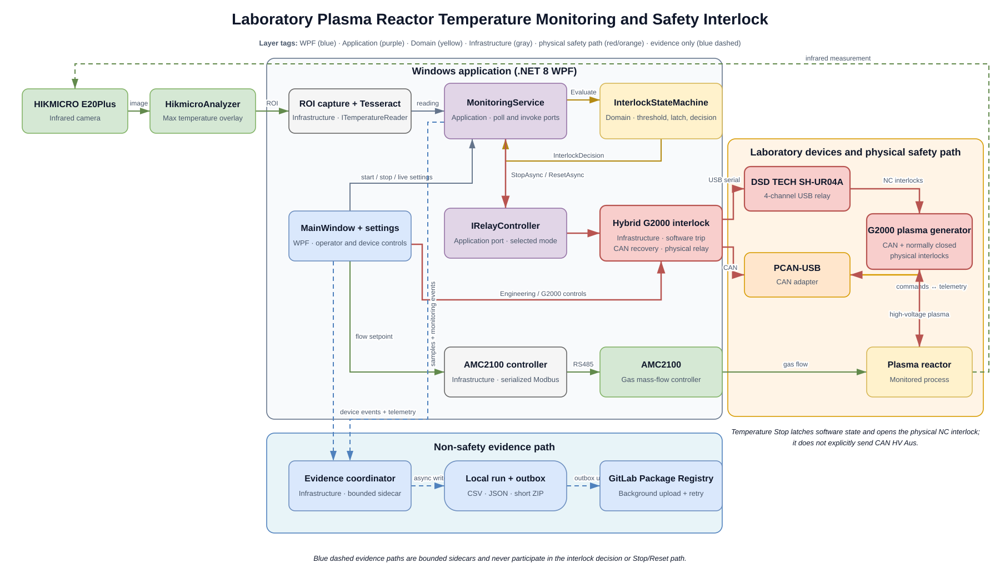

# Laboratory Plasma Reactor Temperature Monitoring and Safety Interlock

This repository contains a Windows desktop application for monitoring the maximum temperature shown by HikmicroAnalyzer and integrating that measurement into the G2000 plasma generator interlock path. The application uses screen capture and Tesseract OCR because the laboratory's HIKMICRO E20Plus workflow does not provide a usable software API.

The software can also control and observe the G2000 over CAN, operate the four-channel physical interlock relay, control an AMC2100 gas mass-flow controller, and collect report-oriented experiment evidence.

> **Safety scope:** this is a laboratory research prototype, not a certified safety controller. The physical G2000 interlock, wiring, device manuals, multimeter checks, and laboratory operating rules remain authoritative. Never treat a software status message as independent proof that high voltage, gas flow, or relay contacts changed physically.

## Part I — Operator Guide

### What the system does

During monitoring, the application follows this chain:

1. Find the HikmicroAnalyzer window by its title.
2. Capture the saved region of interest (ROI) containing the `Max` temperature overlay.
3. Run Tesseract OCR and parse the highest valid temperature.
4. Evaluate the reading in the latched interlock state machine.
5. If the temperature reaches or exceeds the configured threshold, latch the companion G2000 software-trip state and open the enabled physical interlock channels. The normally closed physical interlock is the temperature-trip stop path.
6. Log the sample and send a copy to the independent experiment-evidence recorder.

The temperature interlock and the AMC2100 gas controller are intentionally independent. Gas can continue after a plasma trip for cooling unless an operator explicitly commands the AMC2100 to stop.

### Laboratory hardware represented by the current configuration

| Component | Role | Current laboratory reference |
|---|---|---|
| HIKMICRO E20Plus | Infrared measurement | HikmicroAnalyzer displays a `Max` temperature such as `Max: 76.5 °C` |
| Windows PC | Runs HikmicroAnalyzer, OCR, monitoring, device control, and evidence recording | Windows 10 or later |
| DSD TECH SH-UR04A | Four physical dry-contact interlock branches | USB serial, CP210x, `9600 8N1` |
| PCAN-USB | Native G2000 command and telemetry path | CAN channel configured in `appsettings.json` |
| G2000 | Plasma generator and interlock target | CAN control plus normally closed physical interlocks |
| AMC2100 | Gas mass-flow controller | RS485 Modbus RTU, normally `19200`, slave address `1` |

The verified relay mapping stored in the default configuration is:

| Relay channel | G2000 interlock branch | Open command | Close command |
|---|---|---|---|
| CH1 | Interlock A negative, `I1-I2` | `AT+CH1=0` | `AT+CH1=1` |
| CH2 | Interlock A positive, `I5-I6` | `AT+CH2=0` | `AT+CH2=1` |
| CH3 | Interlock B negative, `I3-I4` | `AT+CH3=0` | `AT+CH3=1` |
| CH4 | Interlock B positive, `I7-I8` | `AT+CH4=0` | `AT+CH4=1` |

Do not infer wiring solely from this table. Confirm every branch against the G2000 manual and the actual laboratory wiring before enabling high voltage.

### Install the laboratory software

Prefer the self-contained Windows release package for the laboratory PC. It includes the .NET runtime, but the following external software and drivers are still required:

- HikmicroAnalyzer, with the camera connected and the maximum-temperature overlay enabled.
- A complete Tesseract OCR installation or portable folder containing `tesseract.exe` and the required language data.
- The CP210x driver for the DSD TECH relay.
- The PEAK PCAN driver for G2000 CAN control.
- The correct USB/RS485 driver for the AMC2100 adapter, when gas control is enabled.

Installation sequence:

1. Extract the release ZIP to a short, writable folder such as `C:\ReactorInterlock`.
2. Install the required device drivers.
3. Start HikmicroAnalyzer and verify that the live thermal image and `Max` overlay update.
4. Run `ReactorSoftInterlock.Wpf.exe`.
5. Keep `appsettings.json` next to the executable. The application updates this file when settings are saved.
6. If portable Tesseract is not included, enter the installed executable path, for example `C:\Program Files\Tesseract-OCR\tesseract.exe`.

### Commission the physical interlock before a plasma run

The relay contact side must remain a passive dry contact. The PC, USB module, or software must never inject a voltage into the G2000 interlock terminals.

Use this order for initial commissioning:

1. Verify HikmicroAnalyzer and OCR before relying on any automatic action.
2. Connect the DSD TECH relay to the PC without connecting it to G2000.
3. Confirm its COM port in Windows Device Manager.
4. Use the Engineering page to open and close each channel.
5. Measure continuity at `COM-NO` and `COM-NC`; do not rely only on relay LEDs or UI text.
6. Confirm that all four branches are normally closed in the permitted state and open in the trip state.
7. Connect the dry contacts to the laboratory-confirmed G2000 interlock terminals.
8. Test the complete interlock response with G2000 in a low-risk state before generating plasma.
9. Confirm that opening the interlock produces the expected G2000 interlock fault and removes high voltage.
10. Only then enable real temperature-triggered operation.

The detailed bench procedure is in [docs/Engineering-Checklist.md](docs/Engineering-Checklist.md).

### First-time application setup

1. Start HikmicroAnalyzer and choose a stable window layout.
2. Ensure that the overlay displays the maximum temperature, for example `Max: 76.5 °C`.
3. Start the interlock application.
4. Choose the UI language from the field labelled `Language / Sprache`.
5. Set `Window` to a stable substring of the HikmicroAnalyzer title; the default `Hikmicro` normally works.
6. Set the Tesseract path.
7. Enter and verify the trip threshold, recovery threshold, recovery stable time, and sampling interval.
8. Configure the relay COM port, G2000 CAN channel, and AMC2100 port as required.
9. Click `Save Settings`.
10. Keep `Dry run relay` enabled during OCR and relay-bench validation. The default configuration does not operate the physical relay, and G2000 CAN mode blocks a real monitoring start while Dry run remains enabled. Clear it only after the wiring and contact states have been verified with a multimeter.
11. Click `Select ROI` and draw a rectangle around only the `Max` temperature overlay.
12. Check the Engineering page and device status before clicking `Start`.
13. After monitoring starts, confirm that `Temperature`, `Raw OCR text`, and the chart all show plausible values.

### Select and preserve a reliable OCR ROI

ROI quality is the most important condition for reliable temperature recognition.

- Select the numeric `Max` overlay and its unit, with a small margin around the text.
- Exclude timestamps, scale labels, other temperatures, and changing graphics.
- Prefer a sharp, high-contrast overlay at a stable HikmicroAnalyzer zoom level.
- The ROI is stored relative to the HikmicroAnalyzer window. Moving the whole window should normally remain valid; resizing the window, changing the Analyzer layout, changing display scaling, or moving the overlay inside the window can require a new ROI.
- The current capture path can often continue when another window covers HikmicroAnalyzer: it tries a direct window capture before falling back to foreground screen capture. This has worked in laboratory use, but support depends on Windows, graphics drivers, and the vendor application. For the most reliable experiment, keep HikmicroAnalyzer open and unobstructed.
- Avoid minimizing HikmicroAnalyzer. The application attempts to restore a minimized window, which can change focus and is less predictable during a long run.
- If the temperature, raw OCR text, or ROI status becomes implausible, select the ROI again before continuing.

HIKMICRO can briefly display exactly `0.0 °C` during automatic camera calibration. The parser treats exact zero as `NO READING`; it cannot reset a tripped interlock and it restarts the automatic-recovery stability timer.

Window capture and each Tesseract process are time-bounded. A stuck capture or OCR process becomes `NO READING` rather than holding the monitoring loop indefinitely. Only one window capture may remain in flight, so repeated timeouts do not accumulate capture threads.

### Normal operating sequence

Before each run:

- Confirm the camera image and `Max` overlay are updating.
- Confirm a fresh, plausible temperature in the application.
- Check the trip threshold, recovery threshold, and stable time.
- Check that the ROI still surrounds the correct overlay.
- Verify the DSD relay COM port and all four interlock branches.
- Power on G2000 before deciding that a missing telemetry warning is a PCAN fault.
- Confirm that the application has received recent G2000 telemetry.
- Check AMC2100 port, enabled state, target, and actual-flow display when gas control is used.
- Confirm the experiment upload status if automatic evidence upload is required.

During the run:

1. Click `Start` and wait for a valid current temperature.
2. If using the automatic G2000 sequence, start it only after monitoring reports a fresh valid reading.
3. Watch temperature, status, raw OCR text, G2000 telemetry, relay state, and actual gas flow.
4. Stop the run and investigate if `NO READING` repeats or the displayed value is not physically plausible.
5. At the end of an experiment, first stop G2000/high voltage with the laboratory-approved control and confirm that the plasma is off. Only then click `Stop` to end temperature monitoring and finalize the evidence package. `Stop` and closing this application do not command `HV Aus`, open the physical interlock, or stop AMC2100; they are not emergency-stop actions.

### Saving settings while plasma is running

`Save Settings` can apply valid monitoring settings without stopping the monitoring task or interrupting plasma control. The monitoring-service portion—temperature/recovery values, poll interval, and OCR/ROI configuration—is switched atomically at a sample boundary, and the service immediately requests a new safety sample.

If AMC2100 is enabled, its target is written and read back in a separate operation after the settings update; that hardware operation can fail independently. G2000 recipe and writable-setpoint values are saved but are not sent to G2000 by `Save Settings`; use `Apply setpoints` or the corresponding automatic-sequence control. Relay mode, relay COM port, PCAN channel, node ID, channel enable flags, and relay command changes are hardware-connection changes and are blocked until monitoring has stopped.

Important latch behavior:

- Saving a higher trip threshold does not clear an interlock that is already tripped.
- Manual `Reset` checks the most recently observed valid temperature. The current implementation has no reading-age limit and does not wait for the stable-time interval; use it only while monitoring is active and the display has just updated to a plausible below-threshold value. Never use it after monitoring has stopped or while `NO READING` repeats.
- Automatic recovery requires valid readings below `Recovery C` for the complete stable-time interval.
- `NO READING`, including HIKMICRO calibration zero, interrupts the stable-time interval.

### Understand trip and recovery

When a valid temperature is at or above `Threshold C`:

1. `InterlockStateMachine` latches the temperature trip.
2. The hybrid controller latches the companion software-trip state inside the G2000 controller; this temperature-trip method does not explicitly send a CAN `HV Aus` command.
3. The physical DSD relay opens all enabled normally closed interlock branches.
4. G2000 should detect the open interlock, report the interlock fault, remove high voltage, and stop the plasma. Verify the physical result onsite.

The logical trip remains latched even if the threshold is edited later. Recovery happens only after the temperature is valid and safely below the configured limit.

In G2000 CAN mode, the configured recovery policy determines the generator-side action after the relay is allowed to close:

- `HoldHvAus`: keep G2000 in HV off for manual continuation.
- `RestoreLastSetpoints`: restore the pre-trip setpoints and return to HV ready.
- `ResumeAutomaticSequence`: restart the configured two-stage sequence.

Always observe the physical reactor and G2000 state after a trip. Software command completion is not independent hardware feedback.

### G2000 and PCAN operation

The application distinguishes two common failures:

- **No recent G2000 telemetry:** first check that G2000 is powered on. Then check CAN cabling, termination, node ID, and channel selection.
- **PCAN interface unavailable:** after confirming G2000 power, check the PCAN adapter, Windows driver, configured channel, and whether another program owns the interface.

Opening a PCAN channel alone is not considered a healthy G2000 connection. The UI confirms communication only after a recent recognized G2000 status or actual-value frame arrives.

The G2000 page supports manual HV states, writable setpoints, target/actual comparison, raw frames, and the configured two-stage automatic sequence. Treat all HV-on controls as high-risk actions.

### AMC2100 gas-flow operation

- Enable AMC2100 before sending a flow command.
- `Save Settings` writes the displayed target setpoint when AMC2100 is enabled and immediately reads the setpoint registers back.
- The `-` and `+` buttons change the target by `10 mL/min` and write it immediately; a separate save is not required.
- `Stop Gas Flow` writes `0`.
- `Apply Gas Setpoint` writes the configured target (the unlocalized startup label may briefly appear as `Restore Gas Flow`).
- Periodic actual-flow reads and manual writes share one serialized Modbus path, preventing simultaneous COM-port access.

The readback confirms the AMC2100 setpoint register, not physical gas movement. Use the live actual-flow value and onsite observation as the physical evidence.

AMC2100 result reporting is independent from G2000. If saving the gas target succeeds while G2000 is powered off, the application can still show a separate G2000 warning. Power on G2000 and retry before diagnosing the PCAN adapter.

### Status meanings

| Status | Meaning | Operator response |
|---|---|---|
| `Idle` | Monitoring is not running | Complete setup checks before starting |
| `Monitoring` | A valid below-threshold temperature is available | Continue observing temperature and raw OCR |
| `NoReading` | Capture/OCR produced no valid temperature | Fix the camera window, ROI, or Tesseract; repeated loss must not be ignored |
| `Tripped` | The temperature state machine latched an over-temperature trip | Confirm plasma/HV stopped, then wait for valid recovery conditions |
| `RelayTestFailed` | The real Stop action failed after an over-temperature decision | Immediately stop HV by the approved external method, verify the plasma is off, and diagnose the output path before continuing |

`NO READING` does not itself issue an over-temperature trip. This is a known limitation of the prototype, so repeated missing readings require operator intervention. G2000 CAN faults and its independent trip latch are shown in the G2000 telemetry area; they do not change the main temperature-status badge to `Tripped`.

### Automatic experiment evidence

No Export button is required for normal evidence collection. Each `Start`/`Stop` monitoring cycle is recorded as an independent run. Engineering, G2000, or AMC2100 activity outside monitoring is also retained and finalized when appropriate.

Data is stored below the configured `DataDirectory`, normally `data`:

```text
data\
├─ temperature-history.csv
├─ lab-profile.json
├─ experiment-sessions\<UTC timestamp>-<run id>\
├─ experiment-bundles\exp-<timestamp>-<short id>.zip
└─ experiment-upload-outbox\
   ├─ pending\
   ├─ uploading\
   ├─ sent\
   └─ failed\
```

Each finalized run can contain temperature samples, event history, G2000 telemetry, AMC2100 flow samples, settings snapshots, a manifest, report summary, laboratory profile snapshot, and a human-readable experiment context.

When automatic upload is enabled, the ZIP is sent in the background to the configured GitLab Generic Package Registry. Failures remain in the persistent outbox and are retried without blocking temperature evaluation or interlock control.

Configure upload under `Tools → GitLab Upload Settings`. The PAT requires GitLab `api` scope and is stored in Windows Credential Manager, not in `appsettings.json`, logs, evidence bundles, or release packages.

`Export CSV` and `Export Experiment Bundle` remain available for manual copies. The evidence package records software-observed behavior; it does not replace temperature calibration, verified hardware feedback, or a safety assessment.

### Operator troubleshooting

| Symptom | Checks |
|---|---|
| HikmicroAnalyzer window not found | Open HikmicroAnalyzer; check the `Window` title substring; avoid minimizing it |
| Repeated `NO READING` | Reselect a tighter ROI; verify `Max` overlay contrast; check the Tesseract path; inspect `Raw OCR text` |
| Wrong temperature | Remove nearby numbers from the ROI; restore the expected Analyzer layout and display scaling |
| Capture timed out | Make HikmicroAnalyzer responsive and visible; wait for the previous single capture attempt to finish |
| Relay does not move | Check `Dry run relay`, COM port, CP210x driver, baud rate, commands, and competing serial tools |
| Relay moves but G2000 continues | Stop the experiment; measure continuity; verify dry-contact wiring and the real interlock branch |
| G2000 communication warning after AMC save | First power on G2000; then check telemetry, CAN cable/termination, PCAN channel, and driver |
| AMC target does not change | Confirm AMC is enabled, correct COM/slave settings, digital control mode, write readback, and actual flow |
| Trip will not reset | For automatic recovery, repair OCR and maintain valid below-recovery readings for the configured stable time. Manual `Reset` has no stable-time or freshness check, so use it only after a newly updated plausible reading while monitoring remains active |
| Upload shows missing credential | Store a current PAT with `api` scope in `Tools → GitLab Upload Settings` |

## Part II — Builder and Developer Guide

### System architecture

[](docs/system-architecture.drawio)

Click the diagram to open the editable draw.io source. The SVG and `.drawio` file describe the same current architecture.

The projects follow Clean Architecture boundaries. The compile-time references are:

```text
WPF           → Application, Domain, Infrastructure
Infrastructure → Application, Domain
Application    → Domain
Domain         → no other project
```

- **Domain** contains the authoritative interlock latch and has no external dependencies.
- **Application** owns use cases and hardware-independent ports.
- **Infrastructure** implements screen capture, OCR, serial, CAN, Modbus, logging, credentials, and upload adapters.
- **WPF** is the composition root and coordinates UI lifecycle without moving safety decisions into event handlers.

The safety-critical monitoring call chain is:

```text
MonitoringService.PollOnceAsync
→ ITemperatureReader.ReadAsync
  → TesseractCliTemperatureReader
→ InterlockStateMachine.Evaluate
→ InterlockDecision
→ IRelayController.StopAsync / ResetAsync
→ mode-specific `DryRun`, `Serial`, or `G2000Can` controller
```

In Hybrid mode, a temperature Stop latches the G2000 controller's software-trip state and opens the physical interlock; it does not explicitly send `HV Aus` over CAN. A latched Reset is a three-phase sequence: prepare a safe recovery state while the interlock is open, close the physical interlock, then complete the selected G2000 recovery policy.

The recorder is a sidecar:

```text
samples / UI events / telemetry
→ ExperimentEvidenceCoordinator
→ ExperimentSessionRecorder
→ local run + ZIP + persistent outbox
→ GitLabExperimentUploader
```

Recorder or network failures must never propagate into the temperature decision, relay action, G2000 command, or AMC2100 command paths.

### Repository layout

| Path | Responsibility |
|---|---|
| `src/ReactorSoftInterlock.Domain` | Interlock settings, decisions, statuses, samples, and latched state machine |
| `src/ReactorSoftInterlock.Application` | Monitoring service, parser, ports, G2000 recovery policy, synchronization decorators |
| `src/ReactorSoftInterlock.Infrastructure` | Window capture, Tesseract CLI, relay/CAN/Modbus adapters, settings, CSV and evidence upload |
| `src/ReactorSoftInterlock.Wpf` | WPF composition root, operator UI, ROI selector, guides, localization, packaged defaults |
| `tests/ReactorSoftInterlock.Tests` | xUnit tests for domain, application, infrastructure, protocol, evidence, and packaging behavior |
| `docs` | Engineering checklist, hardware notes, and editable system architecture |
| `scripts/Package-Release.ps1` | Safe self-contained Windows publish and ZIP packaging |
| `Doc` | Project and device reference documents |

### Development prerequisites

- Windows 10/11 or WSL with access to the Windows .NET SDK.
- .NET 8 SDK.
- Visual Studio 2022 with the `.NET desktop development` workload, or a terminal with `dotnet`.
- Internet access for the first NuGet restore.
- Real hardware only for hardware-in-the-loop checks; the unit tests do not require the laboratory devices.

WPF targets Windows. Building from WSL is supported when invoking the Windows SDK, but the application itself must run in a Windows desktop session.

### Restore, build, test, and run

Run all commands from the repository root in PowerShell:

```powershell
dotnet restore .\src\ReactorSoftInterlock.sln
dotnet build .\src\ReactorSoftInterlock.sln
dotnet test .\src\ReactorSoftInterlock.sln
dotnet build .\src\ReactorSoftInterlock.sln -c Release
```

Run the application from source:

```powershell
dotnet run --project .\src\ReactorSoftInterlock.Wpf\ReactorSoftInterlock.Wpf.csproj
```

Run in Release configuration:

```powershell
dotnet run -c Release --project .\src\ReactorSoftInterlock.Wpf\ReactorSoftInterlock.Wpf.csproj
```

Visual Studio users can open `src\ReactorSoftInterlock.sln`, select `ReactorSoftInterlock.Wpf` as the startup project, and press `F5`.

### Build a laboratory deployment package

The preferred packaging path is the repository script:

```powershell
New-Item -ItemType Directory -Force C:\Temp | Out-Null
powershell -ExecutionPolicy Bypass -File .\scripts\Package-Release.ps1 `
  -ZipPath C:\Temp\RSI-local.zip
```

The script:

- publishes `win-x64` in Release mode as a self-contained application;
- disables PDB generation for the package;
- builds in a fresh random temporary directory;
- checks every output file against a software/runtime allowlist;
- rejects experiment data, upload outboxes, credentials, and unexpected files;
- refuses to overwrite an existing ZIP;
- removes its temporary publish directory afterward.

For an unpacked development publish, use:

```powershell
dotnet publish .\src\ReactorSoftInterlock.Wpf\ReactorSoftInterlock.Wpf.csproj `
  -c Release `
  -r win-x64 `
  --self-contained true `
  -o .\artifacts\ReactorSoftInterlock-win-x64
```

### Configuration and runtime files

`appsettings.json` is copied beside the executable and updated by the application. Important groups are:

- top-level monitoring values: language, threshold, recovery policy, polling interval, window title, ROI, and data directory;
- `Ocr`: Tesseract executable, language, and timeout;
- `Relay`: mode, dry-run state, serial settings, four relay channels, and G2000 CAN settings;
- `Amc2100`: enabled state, COM settings, Modbus registers, digital mode, and target flow;
- `ExperimentUpload`: GitLab target and upload behavior, never the PAT itself.

Application-owned relative paths are resolved from the executable directory, not the developer's current shell directory. This includes `appsettings.json`, a relative `DataDirectory`, and a portable Tesseract path that contains a directory. Absolute paths remain absolute; a bare `tesseract.exe` can also be resolved through `PATH` or common installation locations.

### Design constraints to preserve

- `InterlockStateMachine` remains the authoritative trip latch.
- Temperature read, evaluation, Stop/Reset, and sample logging are serialized at the monitoring sample boundary.
- A settings hot-apply must not clear a trip, rebuild a live controller, or reconnect G2000.
- Manual reset and automatic reset require a valid recovery reading; `NO READING` cannot authorize reset.
- In the hybrid temperature-stop path, the G2000 software-trip state is latched and the physical interlock is opened; the method does not explicitly issue CAN `HV Aus`.
- Latched hybrid recovery must retain its three phases: prepare while the interlock is open, close the physical interlock, then complete the recovery policy.
- UI telemetry dispatch must remain non-blocking for CAN reader threads.
- AMC2100 reads and writes must remain serialized on one COM-port command path.
- Experiment recording and GitLab upload remain bounded, asynchronous sidecars.
- Windows Credential Manager remains the PAT's only persistent storage location; the value must never be serialized into settings, logs, tests, archives, or exceptions.

### Testing guidance

Run the full test suite after every functional change:

```powershell
dotnet test .\src\ReactorSoftInterlock.sln
```

Run a focused test class while developing:

```powershell
dotnet test .\src\ReactorSoftInterlock.sln `
  --filter "FullyQualifiedName~InterlockStateMachineTests"
```

Before a merge or deployment package, run both Debug and Release builds, the full tests, and the release packaging script. Hardware behavior must still be checked separately with the real HIKMICRO camera, relay, PCAN/G2000, and AMC2100.

### Related technical documentation

- [Engineering checklist](docs/Engineering-Checklist.md)
- [G2000 soft-interlock notes](docs/g2000-soft-interlock.md)
- [Editable system architecture](docs/system-architecture.drawio)
- [Rendered system architecture](docs/system-architecture.svg)
